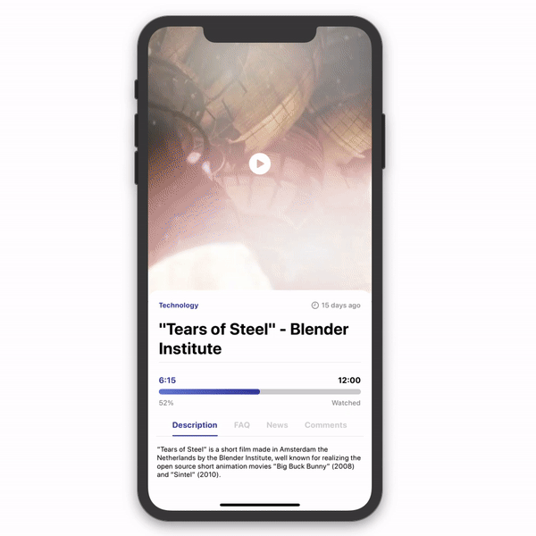
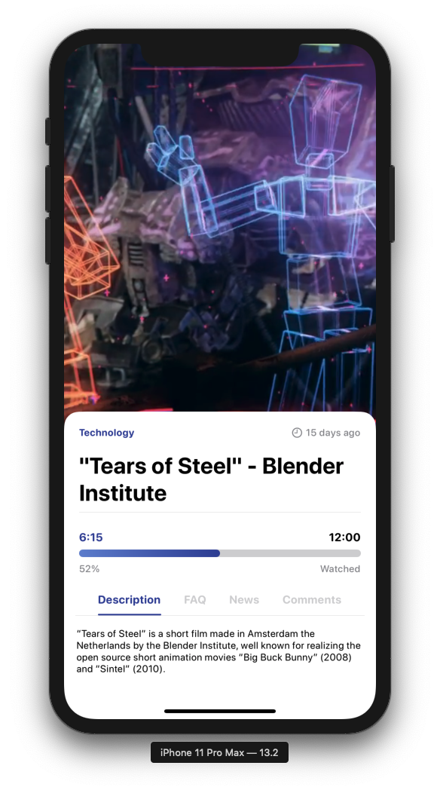
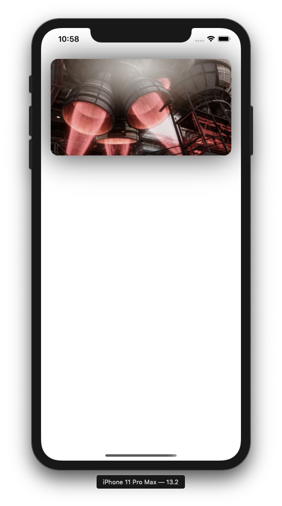

# Video Card - In SwiftUI

Written for [TrailingClosure.com](https://trailingclosure.com/learn-how-to-create-a-video-card-using-swiftui/).

> We're happy to provide our tutorial on creating a VideoCard in SwiftUI. The tutorial walks you through the implementation of the custom UIView all the way through utilizing the card in your own SwiftUI project.

